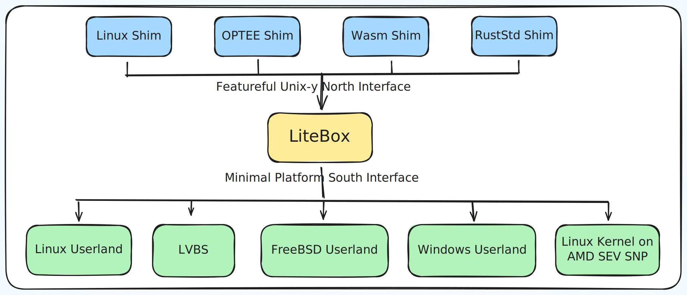

# LiteBox

> A security-focused library OS

LiteBox is a sandboxing library OS that drastically cuts down the interface to the host, thereby reducing attack surface.  It focuses on easy interop of various "North" shims and "South" platforms.  LiteBox is designed for usage in both kernel and non-kernel scenarios.

LiteBox exposes a Rust-y [`nix`](https://docs.rs/nix)/[`rustix`](https://docs.rs/rustix)-like "North" interface when it is provided a `Platform` interface at its "South".  These interfaces allow for a wide variety of use-cases, easily allowing for connection between any of the North--South pairs.

Example use cases include:
- Running unmodified Linux programs on Windows
- Sandboxing Linux applications on Linux
- Run programs on top of SEV SNP
- Running Wasm WASI programs
- Running OP-TEE programs on Linux
- Running on LVBS

